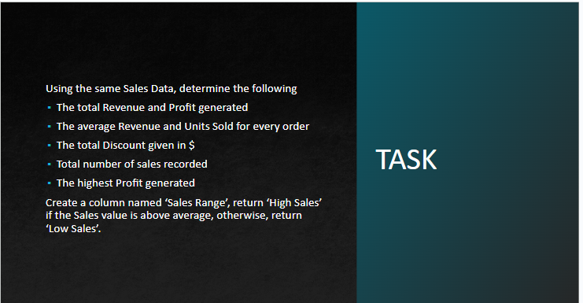
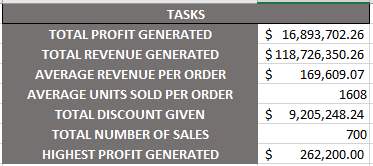

# Sales-data-

## Introduction

For this task I was provided with a dataset containing the sales data for a company and I am to retrieve some information from it using Microsoft Excel functions to better understand the sales performance of this company.

## Skills Demonstrated

The following excel features were utilized-
- SUM
- AVERAGE
- MAX
- COUNT
- IF

## Analysis

Although these deductions are not a thorough analysis of the dataset, the total profit generated is a very small percentage of the total revenue generated and this points to the fact that the business does not seem to be doing so well.
I used the average revenue generated to create a sales band that showed that a higher percentage of the sales made were below the average sales value. This reinforces the earlier deduction that the business is not doing well.
I also observed that the total discount given out was very high and must be a major contributor to the low profit generated.

## Conclusion

The stakeholders of this company need to do further analysis to improve performance as early as possible to avoid further loss.
