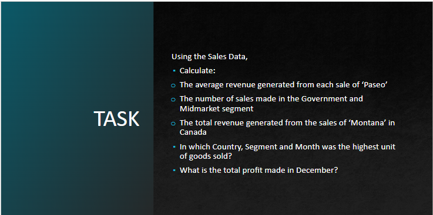
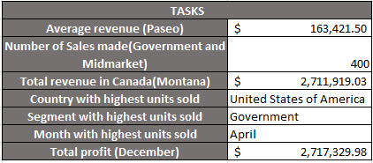

# Sales-data-

## Introduction

For this task I was provided with a dataset containing the sales data for a company and I am to retrieve some information from it using Microsoft Excel functions to better understand the sales performance of this company.

## Skills Demonstrated

The following excel features were utilized-
- SUM
- AVERAGE
- MAX
- COUNT
- IF

## Analysis

Although these deductions are not a thorough analysis of the dataset, the total profit generated is a very small percentage of the total revenue generated and this points to the fact that the business does not seem to be doing so well.
I used the average revenue generated to create a sales band that showed that a higher percentage of the sales made were below the average sales value. This reinforces the earlier deduction that the business is not doing well.
I also observed that the total discount given out was very high and must be a major contributor to the low profit generated.

## Conclusion

The stakeholders of this company need to do further analysis to improve performance as early as possible to avoid further loss.

## Further Analysis

I was given some more tasks on the dataset to dig deeper for insights and a better understanding.

## Skills Demonstrated

The following excel features were utilized-
- SUM
- SUMIF
- SUMIFS
- AVERAGEIF
- COUNTIFS
- MAX
- VLOOKUP

## Analysis and Recommendations

After calculating the average revenue for "Paseo", I discovered that it is the best performing product compared to all others and my recommendation to the stakeholders will be to invest more resources in it and also expand the reach. 
I also found that the Government segment made the most sales of all 5 segments which points to the fact that the store should maximise the opportunity to increase supply to meet the high demand in the government segment. Also the United States of America sold the highest number of units and should consequently be explored further. The most number of units were sold in April, a further investigation should be carried out so as to find out what unique event made this month stand out compared to others. This will allow for better decision making surrounding what time of the year to push sales.

